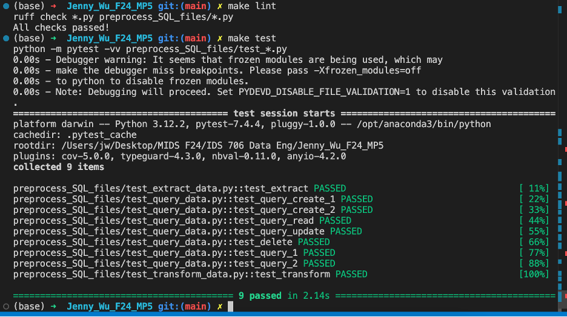

# Jenny_Wu_F24_MP5

#### Purpose of Project
In this project, I built a pipeline that connects a publicly available CSV to a SQLite database and executes Create, Read, Update, and Delete (CRUD) operations using SQL syntax in a Python script. These operations could be used in the future to update entries in the database. In this example, each database entry represents a breakdown of every shooting incident that occurred in NYC going back to 2006 through the end of the previous calendar year. 

#### Requirements:

- [X] Connect to a SQL database
- [X] Perform CRUD operations
- [X] Write at least two different SQL queries
- [X] Database connection
- [X] CI/CD pipeline
- [X] Test each operation works by loading the .db file into your pipeline 
- [X] README.md
- [X] Screenshot or log of successful database operations

---
##### Folder Navigation
Here is a quick overview of how the folders are structured for this project:
.dev container
- devcontainter.json
- Dockerfile
.github 
    workflows
        - main.yml
pictures
    - successful_tests.png

preprocess_SQL_files
- extract_data.py
    The code to extract data from the URL is located here.
- query_data.py
    The code to Create, Read, Update, and Delete observations is located here.
- transform_data.py
    The code to pipe the extracted data into a .db is located here. 
- test_extract_data.py
- test_query_data.py
- test_transform_data.py
main.py
    The code to call the functions is located here. 
Makefile
README.md
requirements.txt

##### Screenshots of successful database operations
